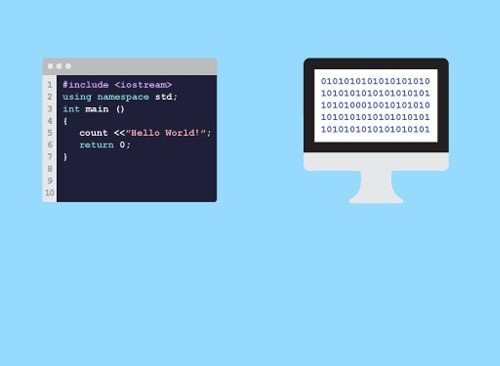
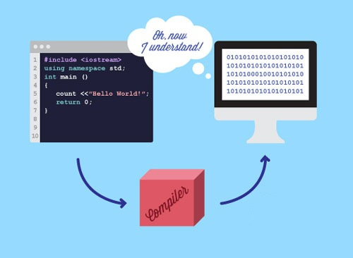
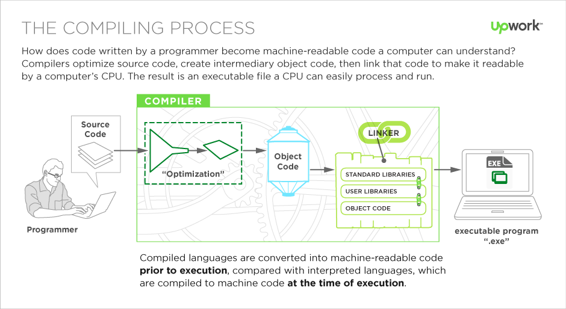
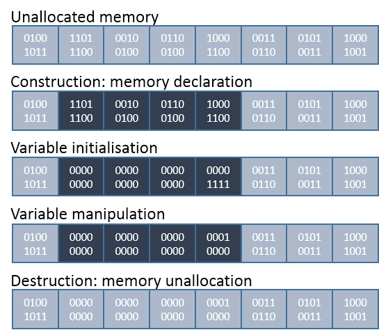
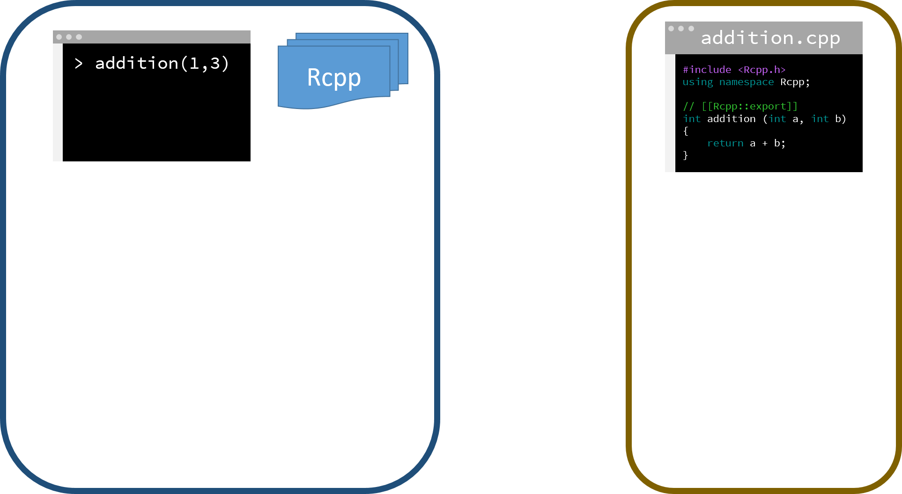
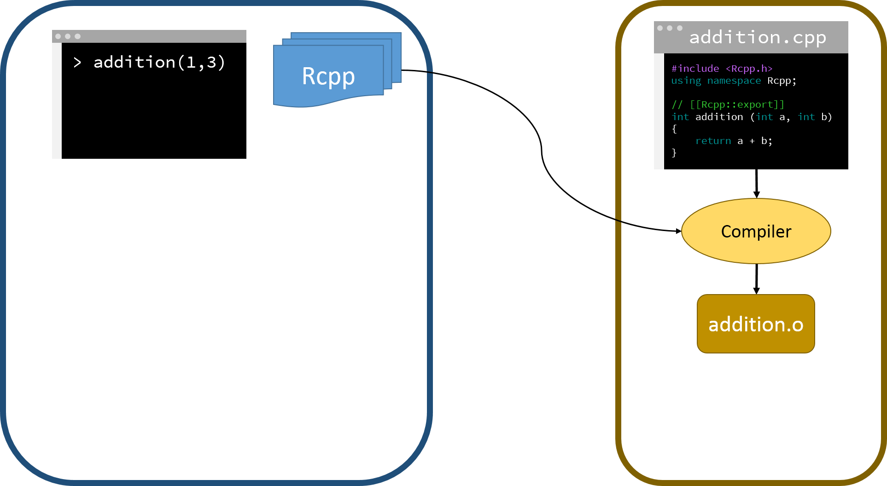
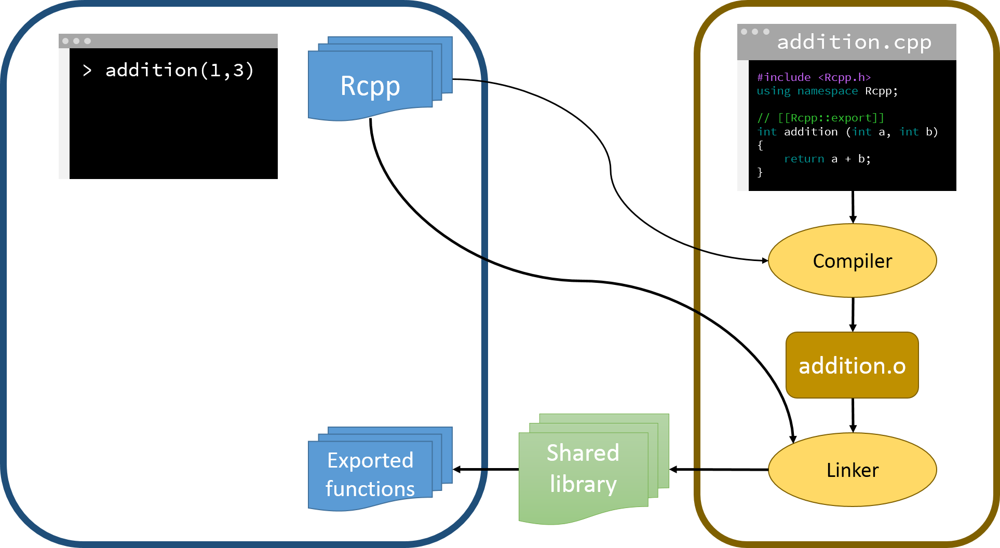
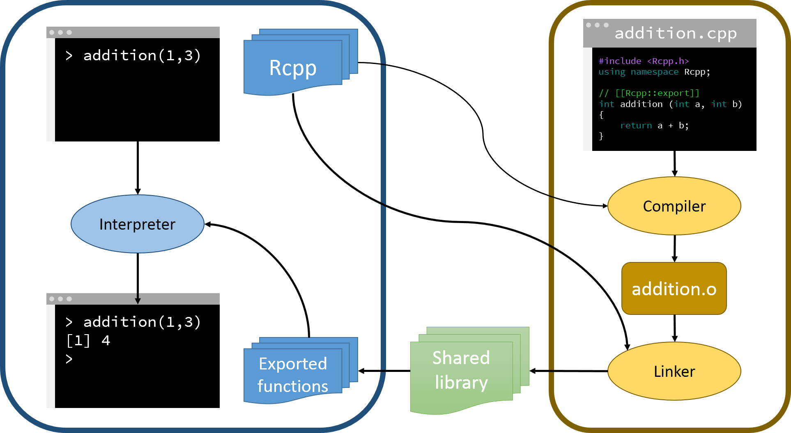
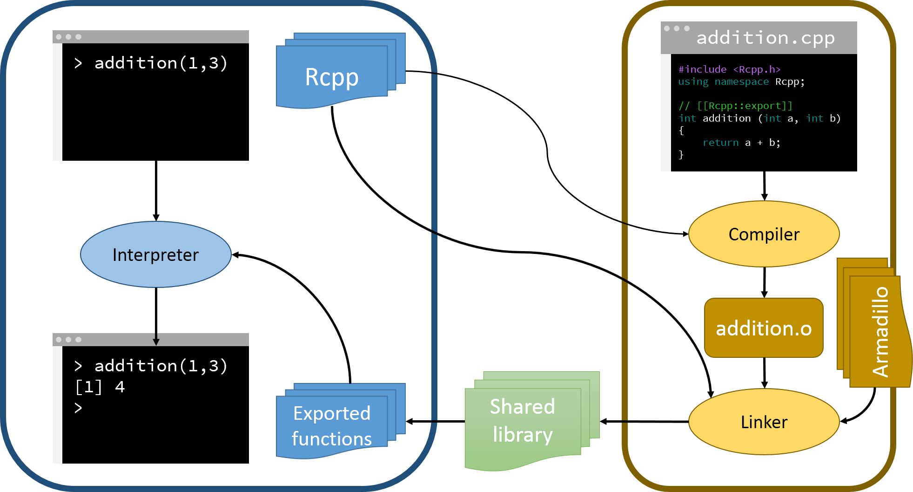
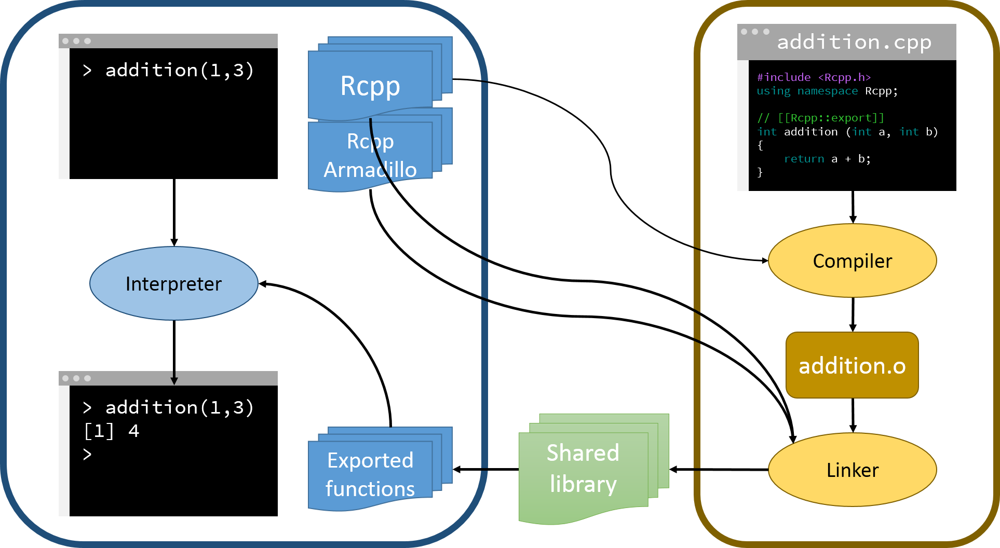

  
<style>
.forceBreak { -webkit-column-break-after: always;
              break-after: column; }
</style>

# What are the architectural differences between R and C++?

## From source code to binary

- High level language : the statistician understands and writes "english".
- Low level language: the CPU reads and runs binary (or machine) codes only.

<center></center>

## From source code to binary

We need a translator (compiler or interpreter) to go from source to binary code.

<center></center>

***

<center></center>

## Compiler versus interpreter
   
---------------------------------------------------------------------------------------------------
         The __Compiler__                             The __Interpreter__
-------- -------------------------------------------- ---------------------------------------------
Input    takes the __entire program__ and translates  takes __one statement at a time__.
         it as a whole into machine code.

Workload runs once and only needs to be called again  runs each time the code needs to be executed.
         for re-translation.   

Errors   generates the error message only after       continues translating the program until the 
         scanning the whole program: debugging is     first error is met, in which case it stops: 
         hard.                                        debugging is easy.

Sharing  harder to share: binary may not be read by   easy to share: just pass the source code.
         different OS, source code must be 
         re-compiled.      
---------------------------------------------------------------------------------------------------

## Compiled language: memory allocation

<div class="columns-2">
  Because at "compile time", the compiler needs to know exactly what objects are, use of variables is less flexible:

```{c eval=FALSE}
int x;      // Construction: allocate 
            // memory to the object.
            
x = 15;     // Initialisation of 
            // the object.
            
x = x + 1;  // Do stuff.

~x;         // Destruction: clear memory. 
            // Usually implicit.
```

  
</div>


# How Rcpp goes from C++ to R

***

<div align="center">

</div>

***

<div align="center">

</div>

***

<div align="center">

</div>

***

<div align="center">

</div>

***

<div align="center">

</div>

***

<div align="center">

</div>

